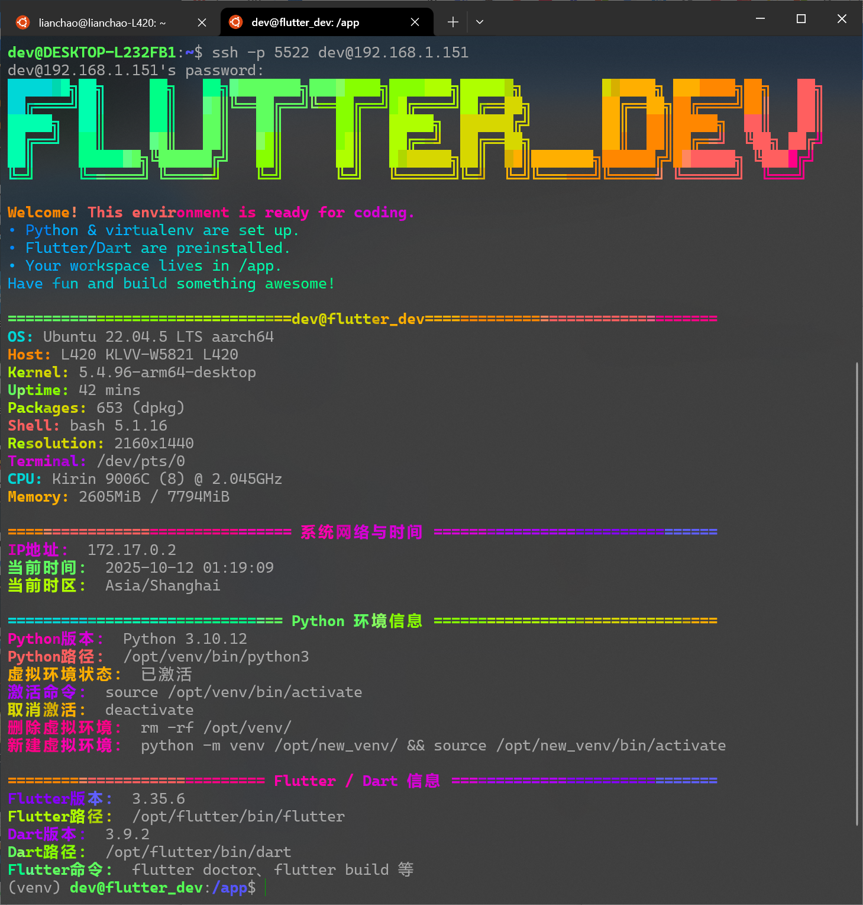

# frontend_flutter_dev
一个适用于flutter web和linux软件开发的docker容器,基于ubuntu22.04创建.

------

## 镜像使用说明

> - 暴露了容器`22`端口,可以在创建容器的时候自行增加宿主机的端口映射.开启了`ssh`服务并自动启动.`dev`或者`root`用户都可以通过`ssh`工具进行登录.
> - 镜像中创建了一个名为`dev`的管理员用户,`root`用户和`dev`用户的密码都是`dev`.
> - 加入了bash-completion修正,并且注释了/etc/apt/apt.conf.d/docker-clean中部分影响apt install <tab> <tab>补全功能的内容,会让镜像容量变得稍大,但是后续需要补充安装包的时候更方便
> - 加入了时区设置到Asia/Shanghai,并且加入了每小时自动同步一次时间的功能
> - 补充了部分常用工具,如`vi | vim | nano | btop | neofetch`等
> - 加入了一个ssh登陆后打印`系统信息 | IP地址 | 当前时间 | 当前时区`的功能

我目前这版镜像上传到了docker hub,提前构建了amd64和arm64镜像,可以直接使用.链接地址是:

https://hub.docker.com/r/ignislee/frontend_flutter_dev

1.0: ubuntu底包+flutter环境

2.0: ubuntu底包+flutter环境+打包好的python venv环境


一键启用命令参考:

```bash
sudo docker run -d \
--name flutter_dev \
--hostname flutter_dev \
--privileged \
--restart=always \
-p 5522:22 \
-p 23000:3000 \
-v ./app:/app \
ignislee/frontend_flutter_dev:2.0
```

使用ARM64版镜像测试使用效果如下图:



镜像中打包了一个测试用的python脚本.如果你在/app目录下,可以直接使用命令启动这个服务.

```bash
# 开启一个python网页服务,端口号可以不指定,默认是3000
python app.py -- port 3000
```

这样就能通过`http://宿主机IP:23000`进行访问了.测试页面如下:


------

## 手动创建常用命令

```bash
# macvlan方式
sudo docker run -d \
  --name ubuntu_2204 \
  --hostname ubuntu_2204 \
  --network 1panel_macvlan \
  --ip=192.168.1.233 \
  --privileged \
  --restart=always \
  ubuntu_dev:22.04


# 桥接，并映射端口到宿主机
sudo docker run -d \
  --name ubuntu_2204 \
  --hostname ubuntu_2204 \
  --network bridge \
  --privileged \
  --restart=always \
  -p 5522:22 \
  ubuntu_dev:22.04


# 桥接，并映射端口到宿主机，并挂载外部文件夹
sudo docker run -d \
--name ubuntu_2204 \
--hostname ubuntu_2204 \
--network bridge \
--privileged \
--restart=always \
-p 5522:22 \
-v ./app:/app \
ubuntu_dev:22.04
```


------

## 基本构建命令，-t指定镜像名称和标签
```bash
docker build -t ubuntu_dev:22.04 .
```


## 构建成功后查看镜像
```bash
docker images | grep ubuntu_dev:22.04
```


## 运行构建好的镜像验证

```bash
docker run ubuntu_dev:22.04
```


## 将镜像保存为tar文件

```bash
docker save -o [保存的文件名.tar] [镜像名称:标签]
```


## 保存镜像到当前目录

```bash
docker save -o ubuntu_dev-22.04.tar ubuntu_dev:22.04
```


## 加载保存的镜像

```bash
docker load -i ubuntu_dev-22.04.tar
```


------

## docker compose启动命令

```bash
sudo docker compose down && sudo docker compose up -d
```

